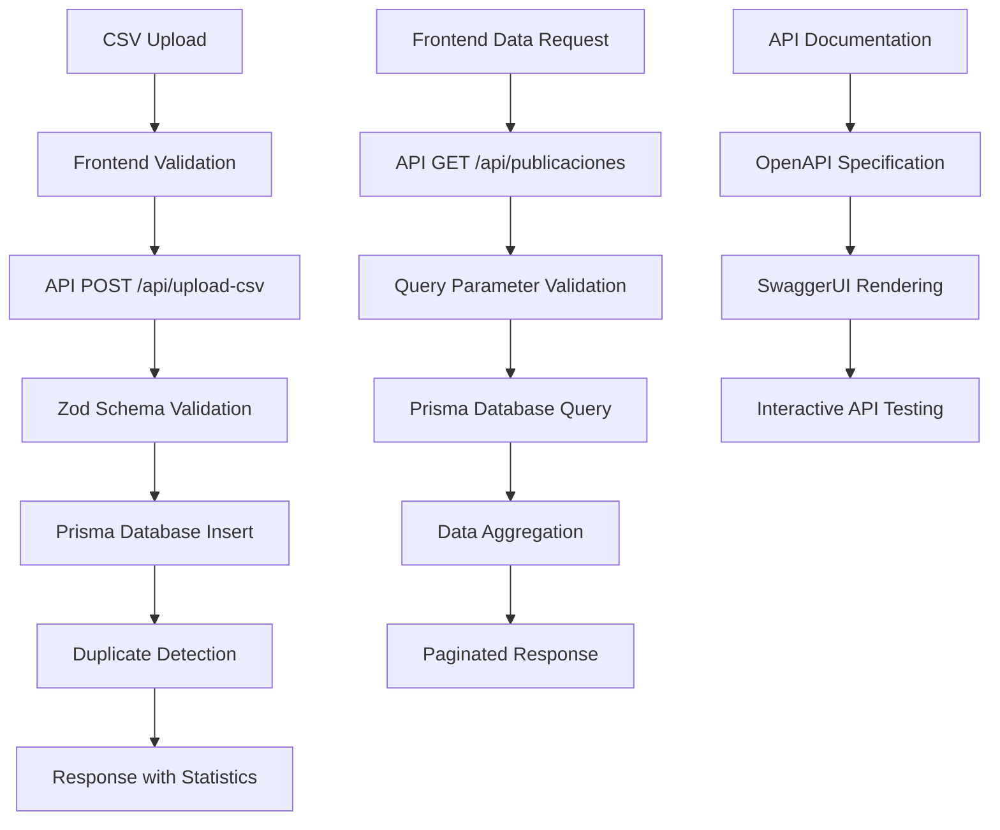

# 🔧 Documentación Técnica - API First Architecture

## 📋 Arquitectura del Sistema

### **Arquitectura API First**

```
┌─────────────────────────────────────────────────────────────┐
│                    Frontend (Next.js 14)                    │
├─────────────────────────────────────────────────────────────┤
│  Components    │  Hooks        │  Pages                     │
│  - CSVUploader │  - useCSVUpload│  - Dashboard (/)          │
│  - StatusBanner│  - usePublica..│  - Profile Details        │
│  - Charts      │  - Custom hooks│  - API Docs               │
├─────────────────────────────────────────────────────────────┤
│                    API Layer (Next.js API Routes)           │
├─────────────────────────────────────────────────────────────┤
│  Validation    │  Routes       │  Documentation            │
│  - Zod Schemas │  - /api/upload│  - OpenAPI/Swagger        │
│  - Type Safety │  - /api/public│  - Interactive Docs       │
│  - Error Handle│  - /api/docs  │  - Schema Validation      │
├─────────────────────────────────────────────────────────────┤
│                    Data Layer (Prisma + SQLite)             │
├─────────────────────────────────────────────────────────────┤
│  ORM           │  Database     │  Migrations               │
│  - Prisma      │  - SQLite     │  - Schema Evolution       │
│  - Type Safety │  - ACID       │  - Data Integrity         │
│  - Queries     │  - Indexing   │  - Backup/Restore         │
└─────────────────────────────────────────────────────────────┘
```

### **Flujo de Datos API First**



## 🧮 Funciones de Procesamiento de Datos

### 1. `parseNumber(numStr: string): number`
**Propósito**: Parsear números con formato de miles separados por comas.

```typescript
const parseNumber = (numStr: string): number => {
  if (!numStr || numStr.trim() === '') return 0;
  const cleaned = numStr.replace(/,/g, '');
  const parsed = parseInt(cleaned, 10);
  return isNaN(parsed) ? 0 : parsed;
};
```

**Casos de Uso**:
- `"32,374"` → `32374`
- `"1,234,567"` → `1234567`
- `""` → `0`
- `"invalid"` → `0`

### 2. `normalizeCategory(raw: string): string`
**Propósito**: Normalizar nombres de categorías del CSV.

```typescript
function normalizeCategory(raw: string): string {
  let c = (raw || '').trim();
  if (!c) return 'Sin categoría';
  
  // Remover comillas
  c = c.replace(/^["']|["']$/g, '');
  
  // Manejar N/A, guiones, etc.
  if (!c || /^(n\/a|na|n\.a\.?|-+|_+)$/i.test(c)) {
    return 'Sin categoría';
  }
  
  // Normalizar nombres conocidos (orden específico → genérico)
  if (/invertir.*para.*crecer/i.test(c)) return 'INVERTIR PARA CRECER';
  if (/seguridad/i.test(c)) return 'SEGURIDAD';
  if (/transparencia.*publica/i.test(c)) return 'TRANSPARENCIA PÚBLICA';
  if (/error/i.test(c)) return 'Error en procesamiento';
  if (/estrategia/i.test(c)) return 'Sin categoría';
  
  return c;
}
```

**Transformaciones**:
- `"ESTRATEGIA \"INVERTIR PARA CRECER\""` → `"INVERTIR PARA CRECER"`
- `"N/A"` → `"Sin categoría"`
- `"---"` → `"Sin categoría"`

### 3. `aggregate(rows, redKey, perfilKey, catKey): Aggregated`
**Propósito**: Agregar datos para conteo de publicaciones por categoría.

```typescript
type Aggregated = {
  porRedGlobal: Record<string, Record<string, number>>;     // red -> categoria -> count
  perfilesPorRed: Record<string, Set<string>>;             // red -> Set(perfiles)
  porPerfil: Record<string, Record<string, Record<string, number>>>; // red -> perfil -> categoria -> count
  totalPorRed: Record<string, number>;                     // red -> total posts
  totalPorPerfil: Record<string, Record<string, number>>;  // red -> perfil -> total posts
};
```

**Lógica**:
- Cuenta publicaciones (una por fila)
- Maneja múltiples categorías por publicación
- Cada categoría cuenta la publicación completa

### 4. `calculateImpactByProfile(rows, ...): ProfileImpact`
**Propósito**: Calcular impresiones reales divididas proporcionalmente.

```typescript
// Para publicación con múltiples categorías:
const impresionesPerCategory = impresiones / categories.length;

for (const cat of categories) {
  profileImpact[red][perfil][cat] += impresionesPerCategory;
}
```

**Ejemplo**:
```javascript
// Post: "SEGURIDAD,TRANSPARENCIA" con 1000 impresiones
SEGURIDAD: +500 impresiones
TRANSPARENCIA: +500 impresiones
// Total real: 1000 impresiones (sin duplicación)
```

## 🎨 Sistema de Estilos

### Variables CSS Globales

```css
:root {
  /* Colores del Sistema Apple */
  --system-blue: #007AFF;
  --system-green: #34C759;
  --system-red: #FF3B30;
  --system-purple: #5856D6;
  --system-gray: #8E8E93;
  
  /* Gradientes */
  --gradient-blue: linear-gradient(135deg, #007AFF 0%, #5AC8FA 100%);
  --gradient-mesh: radial-gradient(circle at 20% 80%, #007AFF22 0%, transparent 50%),
                   radial-gradient(circle at 80% 20%, #5AC8FA22 0%, transparent 50%);
  
  /* Espaciado */
  --spacing-xs: 4px;
  --spacing-sm: 8px;
  --spacing-md: 16px;
  --spacing-lg: 24px;
  --spacing-xl: 32px;
  
  /* Bordes */
  --radius-sm: 8px;
  --radius-md: 12px;
  --radius-lg: 16px;
  --radius-xl: 24px;
  
  /* Sombras */
  --shadow-sm: 0 2px 8px rgba(0, 0, 0, 0.1);
  --shadow-md: 0 4px 16px rgba(0, 0, 0, 0.1);
  --shadow-lg: 0 8px 32px rgba(0, 0, 0, 0.15);
  
  /* Blur Effects */
  --blur-sm: blur(8px);
  --blur-md: blur(16px);
  --blur-lg: blur(24px);
}
```

### Clases Utilitarias

```css
/* Glassmorphism */
.glass-card {
  background: rgba(255, 255, 255, 0.8);
  backdrop-filter: var(--blur-md);
  border: 1px solid rgba(255, 255, 255, 0.2);
  border-radius: var(--radius-lg);
}

/* Scroll Horizontal */
.horizontal-scroll-container {
  display: flex;
  gap: var(--spacing-lg);
  overflow-x: auto;
  scroll-behavior: smooth;
  -webkit-overflow-scrolling: touch;
}

.horizontal-card {
  flex: 0 0 auto;
  min-width: 380px;
  max-width: 450px;
}
```

## 📊 Integración con Recharts

### Configuración de Gráficas Circulares

```typescript
const renderPieChart = (counts: Record<string, number>, title?: string) => {
  const data = toRechartsData(counts);
  
  return (
    <ResponsiveContainer width="100%" height={400}>
      <PieChart>
        <defs>
          <filter id="shadow-large">
            <feDropShadow dx="0" dy="4" stdDeviation="8" floodOpacity="0.2"/>
          </filter>
        </defs>
        <Pie
          data={data}
          cx="50%"
          cy="50%"
          outerRadius={120}
          dataKey="value"
          animationBegin={0}
          animationDuration={800}
          filter="url(#shadow-large)"
        >
          {data.map((entry, index) => (
            <Cell key={`cell-${index}`} fill={entry.color} />
          ))}
        </Pie>
        <Tooltip content={<CustomTooltip />} />
      </PieChart>
    </ResponsiveContainer>
  );
};
```

### Configuración de Gráficas de Línea

```typescript
<ResponsiveContainer width="100%" height={300}>
  <LineChart data={timeSeriesData}>
    <CartesianGrid strokeDasharray="3 3" stroke="rgba(142, 142, 147, 0.2)" />
    <XAxis 
      dataKey="date" 
      stroke="#8E8E93"
      tick={{ fontSize: 12 }}
    />
    <YAxis 
      stroke="#8E8E93"
      tick={{ fontSize: 12 }}
    />
    <Tooltip content={<CustomTooltip />} />
    <Line 
      type="monotone" 
      dataKey="impresiones" 
      stroke="#007AFF" 
      strokeWidth={3}
      dot={{ fill: '#007AFF', strokeWidth: 2, r: 4 }}
      activeDot={{ r: 6, stroke: '#007AFF', strokeWidth: 2 }}
      animationDuration={1000}
    />
  </LineChart>
</ResponsiveContainer>
```

## 🔄 Gestión de Estado

### Estados Principales

```typescript
// Dashboard Principal
const [rows, setRows] = useState<Row[]>([]);                    // Datos CSV
const [csvLoaded, setCsvLoaded] = useState(false);              // Estado de carga
const [modo, setModo] = useState<'global' | 'perfil' | 'mosaico'>('mosaico');
const [red, setRed] = useState('Instagram');                    // Red seleccionada
const [ordenarPorImpacto, setOrdenarPorImpacto] = useState(false); // Tipo de ordenamiento
const [fechaInicio, setFechaInicio] = useState('');             // Filtro fecha inicio
const [fechaFin, setFechaFin] = useState('');                   // Filtro fecha fin

// Datos Computados (useMemo)
const filteredRows = useMemo(() => /* filtro por fechas */, [rows, fechaInicio, fechaFin]);
const aggregated = useMemo(() => aggregate(filteredRows, ...), [filteredRows, ...]);
const profileImpact = useMemo(() => calculateImpactByProfile(...), [...]);
```

### Persistencia de Datos

```typescript
// Guardar en localStorage
const handleCSV = (file: File) => {
  Papa.parse(file, {
    complete: (res) => {
      const data = res.data.filter(Boolean);
      setRows(data);
      setCsvLoaded(true);
      localStorage.setItem('csvData', JSON.stringify(data));
    }
  });
};

// Cargar desde localStorage
useEffect(() => {
  const savedData = localStorage.getItem('csvData');
  if (savedData) {
    try {
      const parsedData = JSON.parse(savedData);
      setRows(parsedData);
      setCsvLoaded(true);
    } catch (error) {
      localStorage.removeItem('csvData');
    }
  }
}, []);
```

## 🚀 Optimizaciones de Performance

### 1. Memoización de Cálculos Pesados

```typescript
// Evita recálculo innecesario de agregaciones
const aggregated = useMemo(() => 
  aggregate(filteredRows, redKey, perfilKey, catKey), 
  [filteredRows, redKey, perfilKey, catKey]
);

// Evita recálculo de impacto por perfil
const profileImpact = useMemo(() => 
  calculateImpactByProfile(filteredRows, redKey, perfilKey, catKey, parseNumber), 
  [filteredRows, redKey, perfilKey, catKey]
);
```

### 2. Filtrado Eficiente

```typescript
// Filtro por fechas optimizado
const filteredRows = useMemo(() => {
  if (!fechaInicio && !fechaFin) return rows; // Sin filtro = sin procesamiento
  
  return rows.filter(row => {
    const fecha = parseCSVDate(row['Fecha'] || '');
    if (!fecha) return false;
    
    // Comparaciones de fecha optimizadas
    const fechaSolo = new Date(fecha.getFullYear(), fecha.getMonth(), fecha.getDate());
    
    if (fechaInicio && fechaSolo < new Date(fechaInicio)) return false;
    if (fechaFin && fechaSolo > new Date(fechaFin)) return false;
    
    return true;
  });
}, [rows, fechaInicio, fechaFin]);
```

### 3. Renderizado Condicional

```typescript
// Solo renderizar si hay datos
{csvLoaded && rows.length > 0 && (
  <div className="charts-section">
    {/* Componentes de gráficas */}
  </div>
)}

// Renderizado condicional por modo
{!isComparing && modo === 'mosaico' && (
  sortedPerfilesByCategory(red, catOrder, dirOrder).map(perfil => 
    renderPieChart(/* ... */)
  )
)}
```

## 🔍 Debugging y Logging

### Logs de Desarrollo

```typescript
// Debug temporal para verificar parsing
if (rawCats.includes('INVERTIR') && impresiones > 0) {
  console.log('Debug INVERTIR:', {
    perfil: perfil,
    rawCats: rawCats,
    impresiones: impresiones,
    impressionsRaw: r['Impresiones']
  });
}

// Debug para números con comas
if (numStr.includes(',')) {
  console.log(`Parseando: "${numStr}" → ${parsed}`);
}
```

### Herramientas de Desarrollo

```typescript
// React DevTools - Estados observables
const [debugMode, setDebugMode] = useState(process.env.NODE_ENV === 'development');

// Console logs condicionales
const debugLog = (message: string, data?: any) => {
  if (debugMode) {
    console.log(`[DEBUG] ${message}`, data);
  }
};
```

## 🧪 Testing Estratégico

### Casos de Prueba Críticos

1. **Parsing de Números**:
   ```typescript
   expect(parseNumber("32,374")).toBe(32374);
   expect(parseNumber("")).toBe(0);
   expect(parseNumber("invalid")).toBe(0);
   ```

2. **Normalización de Categorías**:
   ```typescript
   expect(normalizeCategory('ESTRATEGIA "INVERTIR PARA CRECER"')).toBe('INVERTIR PARA CRECER');
   expect(normalizeCategory('N/A')).toBe('Sin categoría');
   ```

3. **División Proporcional**:
   ```typescript
   // Post con 2 categorías y 1000 impresiones
   const result = calculateImpactByProfile(testData);
   expect(result['Facebook']['TestProfile']['SEGURIDAD']).toBe(500);
   expect(result['Facebook']['TestProfile']['TRANSPARENCIA']).toBe(500);
   ```

### Pruebas de Integración

```typescript
// Test de flujo completo CSV → Visualización
describe('CSV to Chart Flow', () => {
  it('should process CSV and render charts correctly', () => {
    // 1. Upload CSV
    // 2. Verify data parsing
    // 3. Check aggregation
    // 4. Validate chart rendering
  });
});
```

## 📈 Métricas de Performance

### Objetivos de Performance
- **First Contentful Paint**: < 1.5s
- **Largest Contentful Paint**: < 2.5s
- **Cumulative Layout Shift**: < 0.1
- **Time to Interactive**: < 3s

### Monitoreo

```typescript
// Performance marks para medición
performance.mark('csv-processing-start');
// ... procesamiento CSV
performance.mark('csv-processing-end');
performance.measure('csv-processing', 'csv-processing-start', 'csv-processing-end');

// Web Vitals
import { getCLS, getFID, getFCP, getLCP, getTTFB } from 'web-vitals';

getCLS(console.log);
getFID(console.log);
getFCP(console.log);
getLCP(console.log);
getTTFB(console.log);
```

---

Esta documentación técnica debe actualizarse con cada cambio significativo en la arquitectura o funcionalidades del sistema.
