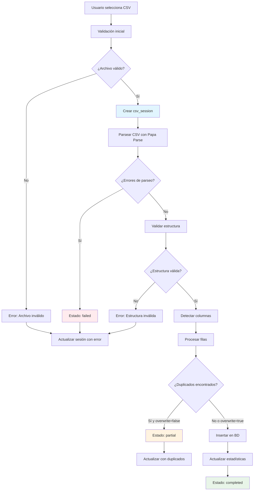
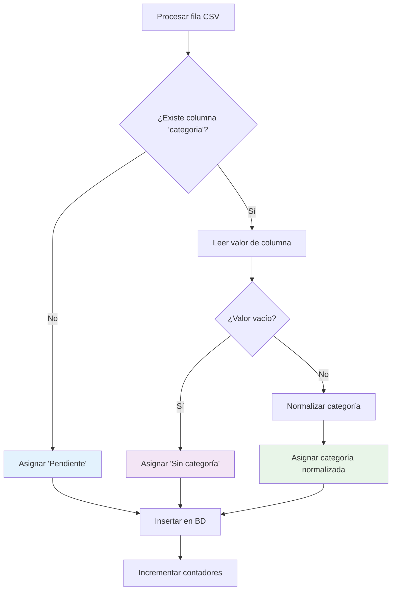

# 📁 Componente CSV Sessions - Documentación Técnica

## Índice
1. [Descripción General](#descripción-general)
2. [Arquitectura del Sistema](#arquitectura-del-sistema)
3. [Funcionalidades](#funcionalidades)
4. [API Endpoints](#api-endpoints)
5. [Componentes de UI](#componentes-de-ui)
6. [Base de Datos](#base-de-datos)
7. [Estados y Flujos](#estados-y-flujos)
8. [Guía de Uso](#guía-de-uso)
9. [Troubleshooting](#troubleshooting)

---

## Descripción General

El componente **CSV Sessions** es un sistema completo de gestión y monitoreo de cargas de archivos CSV. Proporciona visibilidad total sobre el historial de importaciones, estadísticas de procesamiento, manejo de duplicados y seguimiento de registros pendientes de categorización.

### Propósito
- **Auditoría completa** de todas las cargas CSV
- **Monitoreo en tiempo real** del estado de procesamiento
- **Gestión de duplicados** y conflictos de datos
- **Seguimiento de registros pendientes** de categorización
- **Interfaz centralizada** para administración de datos

---

## Arquitectura del Sistema

```
┌─────────────────────────────────────────────────────────────┐
│                    CSV Sessions System                      │
├─────────────────────────────────────────────────────────────┤
│  Frontend (Next.js)           │  Backend (API Routes)       │
│  ┌─────────────────────────┐   │  ┌─────────────────────────┐ │
│  │ /csv-sessions/page.tsx  │◄──┤  │ /api/csv-sessions       │ │
│  │ - Lista de sesiones     │   │  │ - GET: Lista sesiones   │ │
│  │ - Filtros y paginación  │   │  │ - Estadísticas globales │ │
│  │ - Estadísticas resumen  │   │  └─────────────────────────┘ │
│  │ - Integración uploader  │   │                             │
│  └─────────────────────────┘   │  ┌─────────────────────────┐ │
│                                │  │ /api/csv-sessions/[id]  │ │
│  ┌─────────────────────────┐   │  │ - GET: Detalle sesión   │ │
│  │ /csv-sessions/[id]      │◄──┤  │ - Información completa  │ │
│  │ - Detalle de sesión     │   │  └─────────────────────────┘ │
│  │ - Métricas específicas  │   │                             │
│  │ - Logs de procesamiento │   │  ┌─────────────────────────┐ │
│  └─────────────────────────┘   │  │ /api/upload-csv         │ │
│                                │  │ - POST: Procesar CSV    │ │
│  ┌─────────────────────────┐   │  │ - Crear sesión          │ │
│  │ CSVUploader Component   │◄──┤  │ - Validar y procesar    │ │
│  │ - Selección de archivo  │   │  │ - Actualizar estadísticas│ │
│  │ - Manejo de duplicados  │   │  └─────────────────────────┘ │
│  │ - Feedback visual       │   │                             │
│  └─────────────────────────┘   │                             │
└─────────────────────────────────────────────────────────────┘
                                │
                                ▼
                    ┌─────────────────────────┐
                    │    Base de Datos        │
                    │    (SQLite/Prisma)      │
                    │ ┌─────────────────────┐ │
                    │ │   csv_sessions      │ │
                    │ │ - Metadata sesiones │ │
                    │ │ - Estados y tiempos │ │
                    │ │ - Estadísticas      │ │
                    │ └─────────────────────┘ │
                    │ ┌─────────────────────┐ │
                    │ │   publicaciones     │ │
                    │ │ - Datos procesados  │ │
                    │ │ - Relación sesiones │ │
                    │ └─────────────────────┘ │
                    └─────────────────────────┘
```

---

## Funcionalidades

### 🎯 Funcionalidades Principales

#### 1. **Gestión de Sesiones CSV**
- **Historial completo** de todas las cargas realizadas
- **Información detallada** por sesión (archivo, tamaño, fecha, duración)
- **Estados de procesamiento** (processing, completed, failed, partial)
- **Métricas de éxito/error** por sesión

#### 2. **Dashboard de Estadísticas**
```typescript
interface Stats {
  totalSessions: number;        // Total de sesiones creadas
  completedSessions: number;    // Sesiones completadas exitosamente
  failedSessions: number;       // Sesiones que fallaron
  totalRecordsProcessed: number; // Total de registros procesados
  duplicateRecords: number;     // Registros duplicados no subidos
  pendingRecords: number;       // Registros pendientes de categorización
}
```

#### 3. **Sistema de Filtros Avanzados**
- **Por estado**: processing, completed, failed, partial
- **Por nombre de archivo**: búsqueda parcial
- **Por rango de fechas**: startDate y endDate
- **Paginación**: configurable (1-100 elementos por página)

#### 4. **Manejo Inteligente de Duplicados**
- **Detección automática** de registros existentes
- **Diálogo de confirmación** para sobrescribir
- **Estadísticas de duplicados** por sesión y globales
- **Estados parciales** cuando hay conflictos

#### 5. **Seguimiento de Registros Pendientes**
- **Categorización inteligente**: 
  - CSV sin columna "categoría" → `"Pendiente"`
  - CSV con columna vacía → `"Sin categoría"`
- **Contador global** de registros que necesitan categorización
- **Visibilidad** en dashboard para gestión de workflow

#### 6. **Integración de Carga**
- **CSVUploader integrado** en la página principal
- **Feedback visual** en tiempo real
- **Actualización automática** de estadísticas post-carga
- **Manejo de errores** y estados de carga

### 🎨 Funcionalidades de UI/UX

#### 1. **Diseño Responsivo**
- **Mobile-first**: Adaptación completa a dispositivos móviles
- **Grid dinámico**: Ajuste automático de tarjetas de estadísticas
- **Tablas responsivas**: Scroll horizontal en pantallas pequeñas

#### 2. **Indicadores Visuales**
- **Badges de estado**: Colores diferenciados por estado de sesión
- **Métricas destacadas**: Números grandes con contexto claro
- **Progreso visual**: Barras de progreso para tasas de éxito/error

#### 3. **Navegación Intuitiva**
- **Breadcrumbs**: Navegación clara entre páginas
- **Enlaces directos**: Acceso rápido a detalles de sesión
- **Botones de acción**: Claros y accesibles

---

## API Endpoints

### 📡 GET `/api/csv-sessions`

**Descripción**: Lista paginada de sesiones CSV con filtros y estadísticas globales.

#### Parámetros de Query
```typescript
interface QueryParams {
  page?: number;        // Página (default: 1)
  limit?: number;       // Elementos por página (default: 20, max: 100)
  status?: string;      // Filtro por estado
  fileName?: string;    // Búsqueda parcial en nombre
  startDate?: string;   // Fecha inicio (YYYY-MM-DD)
  endDate?: string;     // Fecha fin (YYYY-MM-DD)
}
```

#### Respuesta
```typescript
interface CsvSessionsResponse {
  success: boolean;
  data: CsvSession[];
  pagination: {
    page: number;
    limit: number;
    total: number;
    totalPages: number;
    hasNext: boolean;
    hasPrev: boolean;
  };
  stats: {
    totalSessions: number;
    completedSessions: number;
    failedSessions: number;
    processingSessions: number;
    partialSessions: number;
    totalRecordsProcessed: number;
    totalErrors: number;
    pendingRecords: number;  // 🆕 Registros pendientes
  };
}
```

#### Ejemplo de Uso
```bash
curl "http://localhost:3000/api/csv-sessions?page=1&limit=10&status=completed"
```

### 📡 GET `/api/csv-sessions/[id]`

**Descripción**: Información detallada de una sesión específica.

#### Respuesta
```typescript
interface SessionDetailResponse {
  success: boolean;
  data: {
    // Información básica de la sesión
    id: string;
    fileName: string;
    fileSize: number;
    status: 'processing' | 'completed' | 'failed' | 'partial';
    
    // Métricas de procesamiento
    totalRows: number;
    processedRows: number;
    insertedRows: number;
    updatedRows: number;
    errorRows: number;
    duplicateRows: number;
    excludedHistorias: number;
    
    // Metadatos
    overwrite: boolean;
    startedAt: string;
    completedAt: string | null;
    processingTime: number | null;
    
    // Información de errores
    errorMessage: string | null;
    errorDetails: object | null;
    
    // Datos encontrados
    categoriesFound: string[];
    profilesFound: string[];
    networksFound: string[];
    originalHeaders: string[];
    detectedColumns: object;
    
    // Métricas calculadas
    successRate: string;
    errorRate: string;
    duplicateRate: string;
  };
}
```

---

## Componentes de UI

### 🎨 Página Principal: `/csv-sessions/page.tsx`

#### Estructura del Componente
```typescript
interface CsvSessionsPageState {
  sessions: CsvSession[];           // Lista de sesiones
  loading: boolean;                 // Estado de carga
  error: string | null;             // Errores de API
  pagination: PaginationState;      // Estado de paginación
  stats: GlobalStats;               // Estadísticas globales
  
  // Filtros
  statusFilter: string;
  fileNameFilter: string;
  startDateFilter: string;
  endDateFilter: string;
}
```

#### Secciones de la UI

##### 1. **Header de Página**
```tsx
<div className="page-header">
  <div className="page-title-section">
    <h1>📁 Historial de Cargas CSV</h1>
    <p>Gestiona y monitorea todas las sesiones de carga de archivos CSV</p>
  </div>
  <div className="page-actions">
    <Link href="/">← Volver al Dashboard</Link>
  </div>
</div>
```

##### 2. **Dashboard de Estadísticas**
```tsx
<div className="stats-grid-clean">
  <div className="stat-card-clean">
    <div className="stat-number">{stats.totalSessions}</div>
    <div className="stat-label-clean">Total Sesiones</div>
  </div>
  
  <div className="stat-card-clean success">
    <div className="stat-number">{stats.completedSessions}</div>
    <div className="stat-label-clean">Completadas</div>
  </div>
  
  <div className="stat-card-clean error">
    <div className="stat-number">{stats.failedSessions}</div>
    <div className="stat-label-clean">Fallidas</div>
  </div>
  
  <div className="stat-card-clean info">
    <div className="stat-number">{stats.totalRecordsProcessed}</div>
    <div className="stat-label-clean">Registros Procesados</div>
  </div>
  
  <div className="stat-card-clean warning">
    <div className="stat-number">{duplicateCount}</div>
    <div className="stat-label-clean">Duplicados (No Subidos)</div>
  </div>
  
  <div className="stat-card-clean info">
    <div className="stat-number">{stats.pendingRecords}</div>
    <div className="stat-label-clean">Registros Pendientes</div>
  </div>
</div>
```

##### 3. **Sección de Carga CSV**
```tsx
<div className="upload-section">
  <div className="upload-header">
    <h3>📤 Subir Nuevo Archivo CSV</h3>
    <p>Arrastra un archivo o haz clic para seleccionar</p>
  </div>
  <div className="upload-container">
    <CSVUploader
      compact={false}
      onUploadSuccess={handleUploadSuccess}
      onUploadError={handleUploadError}
      onStatusChange={handleStatusChange}
    />
  </div>
</div>
```

##### 4. **Panel de Filtros**
```tsx
<div className="filters-section">
  <div className="filters-header">
    <h3>🔍 Filtros</h3>
    <button 
      className="btn-clear-filters"
      onClick={clearAllFilters}
      disabled={!hasActiveFilters}
    >
      Limpiar Filtros
    </button>
  </div>
  
  <div className="csv-filters-grid">
    <div className="filter-group">
      <label>Estado</label>
      <select value={statusFilter} onChange={handleStatusChange}>
        <option value="">Todos los estados</option>
        <option value="completed">Completadas</option>
        <option value="failed">Fallidas</option>
        <option value="processing">En proceso</option>
        <option value="partial">Parciales</option>
      </select>
    </div>
    
    <div className="filter-group">
      <label>Nombre de archivo</label>
      <input 
        type="text" 
        value={fileNameFilter}
        onChange={handleFileNameChange}
        placeholder="Buscar por nombre..."
      />
    </div>
    
    <div className="filter-group">
      <label>Desde</label>
      <input 
        type="date" 
        value={startDateFilter}
        onChange={handleStartDateChange}
      />
    </div>
    
    <div className="filter-group">
      <label>Hasta</label>
      <input 
        type="date" 
        value={endDateFilter}
        onChange={handleEndDateChange}
      />
    </div>
  </div>
</div>
```

##### 5. **Tabla de Sesiones**
```tsx
<div className="sessions-table-container">
  <table className="sessions-table">
    <thead>
      <tr>
        <th>Archivo</th>
        <th>Estado</th>
        <th>Registros</th>
        <th>Resultado</th>
        <th>Fecha</th>
        <th>Acciones</th>
      </tr>
    </thead>
    <tbody>
      {sessions.map(session => (
        <tr key={session.id}>
          <td>
            <div className="file-info">
              <div className="file-name">{session.fileName}</div>
              <div className="file-size">{formatFileSize(session.fileSize)}</div>
            </div>
          </td>
          
          <td>
            <span className={`status-badge ${session.status}`}>
              {getStatusLabel(session.status)}
            </span>
          </td>
          
          <td>
            <div className="records-info">
              <div className="total-records">
                {session.totalRows.toLocaleString()}
              </div>
              <div className="processed-records">
                {session.processedRows.toLocaleString()} procesados
              </div>
              {session.duplicateRows > 0 && (
                <div className="duplicate-records">
                  {session.duplicateRows.toLocaleString()} duplicados (no subidos)
                </div>
              )}
            </div>
          </td>
          
          <td>
            <div className="success-error-info">
              <div className="success-count">
                ✅ {session.insertedRows + session.updatedRows}
              </div>
              {session.errorRows > 0 && (
                <div className="error-count">
                  ❌ {session.errorRows}
                </div>
              )}
            </div>
          </td>
          
          <td>
            <div className="date-info">
              <div className="start-date">
                {formatDate(session.startedAt)}
              </div>
              {session.processingTime && (
                <div className="duration">
                  {formatDuration(session.processingTime)}
                </div>
              )}
            </div>
          </td>
          
          <td>
            <div className="actions">
              <Link 
                href={`/csv-sessions/${session.id}`}
                className="btn-view-details"
              >
                Ver Detalles
              </Link>
            </div>
          </td>
        </tr>
      ))}
    </tbody>
  </table>
</div>
```

##### 6. **Paginación**
```tsx
<div className="pagination-container">
  <div className="pagination-info">
    Mostrando {startIndex}-{endIndex} de {pagination.total} sesiones
  </div>
  
  <div className="pagination-controls">
    <button 
      className="btn-pagination"
      onClick={() => handlePageChange(pagination.page - 1)}
      disabled={!pagination.hasPrev}
    >
      ← Anterior
    </button>
    
    <span className="page-indicator">
      Página {pagination.page} de {pagination.totalPages}
    </span>
    
    <button 
      className="btn-pagination"
      onClick={() => handlePageChange(pagination.page + 1)}
      disabled={!pagination.hasNext}
    >
      Siguiente →
    </button>
  </div>
</div>
```

### 🎨 Página de Detalle: `/csv-sessions/[id]/page.tsx`

#### Funcionalidades Específicas
- **Información completa** de la sesión seleccionada
- **Métricas detalladas** de procesamiento
- **Logs de errores** si los hay
- **Información de columnas** detectadas y originales
- **Estadísticas de categorías** y perfiles encontrados

---

## Base de Datos

### 📊 Esquema de Datos

#### Tabla: `csv_sessions`
```sql
CREATE TABLE "csv_sessions" (
    "id" TEXT NOT NULL PRIMARY KEY,
    "file_name" TEXT NOT NULL,
    "file_size" INTEGER NOT NULL,
    "status" TEXT NOT NULL,
    
    -- Contadores de procesamiento
    "total_rows" INTEGER NOT NULL DEFAULT 0,
    "processed_rows" INTEGER NOT NULL DEFAULT 0,
    "inserted_rows" INTEGER NOT NULL DEFAULT 0,
    "updated_rows" INTEGER NOT NULL DEFAULT 0,
    "error_rows" INTEGER NOT NULL DEFAULT 0,
    "duplicate_rows" INTEGER NOT NULL DEFAULT 0,
    "excluded_historias" INTEGER NOT NULL DEFAULT 0,
    
    -- Metadatos del archivo
    "original_headers" TEXT,           -- JSON array de headers originales
    "detected_columns" TEXT,           -- JSON object con mapeo de columnas
    "categories_found" TEXT,           -- JSON array de categorías encontradas
    "profiles_found" TEXT,             -- JSON array de perfiles encontrados
    "networks_found" TEXT,             -- JSON array de redes encontradas
    
    -- Información de errores
    "error_message" TEXT,
    "error_details" TEXT,              -- JSON object con detalles de error
    
    -- Configuración de procesamiento
    "overwrite" BOOLEAN NOT NULL DEFAULT false,
    
    -- Timestamps
    "started_at" DATETIME NOT NULL DEFAULT CURRENT_TIMESTAMP,
    "completed_at" DATETIME,
    "processing_time" INTEGER,         -- Tiempo en millisegundos
    "created_at" DATETIME NOT NULL DEFAULT CURRENT_TIMESTAMP,
    "updated_at" DATETIME NOT NULL
);

-- Índices para optimización
CREATE INDEX "csv_sessions_status_idx" ON "csv_sessions"("status");
CREATE INDEX "csv_sessions_started_at_idx" ON "csv_sessions"("started_at");
CREATE INDEX "csv_sessions_file_name_idx" ON "csv_sessions"("file_name");
```

#### Relación con `publicaciones`
```sql
-- En la tabla publicaciones
"csv_session_id" TEXT,
FOREIGN KEY ("csv_session_id") REFERENCES "csv_sessions"("id")

-- Índice para la relación
CREATE INDEX "publicaciones_csv_session_id_idx" ON "publicaciones"("csv_session_id");
```

### 📈 Consultas Principales

#### 1. **Estadísticas Globales**
```sql
-- Conteo total de sesiones por estado
SELECT status, COUNT(*) as count 
FROM csv_sessions 
GROUP BY status;

-- Total de registros procesados
SELECT 
  SUM(inserted_rows + updated_rows) as total_processed,
  SUM(error_rows) as total_errors
FROM csv_sessions;

-- Registros pendientes de categorización
SELECT COUNT(*) as pending_records 
FROM publicaciones 
WHERE categoria = 'Pendiente';
```

#### 2. **Lista Paginada con Filtros**
```sql
SELECT * FROM csv_sessions 
WHERE 
  ($status IS NULL OR status = $status) AND
  ($fileName IS NULL OR file_name LIKE '%' || $fileName || '%') AND
  ($startDate IS NULL OR started_at >= $startDate) AND
  ($endDate IS NULL OR started_at <= $endDate)
ORDER BY started_at DESC 
LIMIT $limit OFFSET $offset;
```

---

## Estados y Flujos

### 🔄 Estados de Sesión CSV

#### 1. **processing** 
- **Descripción**: Sesión en proceso de carga/validación
- **Transiciones**: → completed, failed, partial
- **UI**: Badge azul con spinner

#### 2. **completed**
- **Descripción**: Sesión completada exitosamente sin errores
- **Condiciones**: 
  - `errorRows = 0`
  - `duplicateRows = 0` (o `overwrite = true`)
  - `completedAt` definido
- **UI**: Badge verde con checkmark

#### 3. **failed**
- **Descripción**: Sesión falló durante el procesamiento
- **Condiciones**: Error crítico que impidió completar
- **Campos**: `errorMessage` y `errorDetails` poblados
- **UI**: Badge rojo con icono de error

#### 4. **partial**
- **Descripción**: Sesión completada con advertencias/duplicados
- **Condiciones**:
  - `duplicateRows > 0` y `overwrite = false`
  - Algunos registros no se procesaron por duplicados
- **UI**: Badge naranja con icono de advertencia

### 🔄 Flujo de Procesamiento CSV



### 🔄 Flujo de Categorización



---

## Guía de Uso

### 👨‍💼 Para Administradores

#### 1. **Monitoreo de Cargas**
```bash
# Acceder al dashboard
http://localhost:3000/csv-sessions

# Verificar sesiones fallidas
Filtrar por: Estado = "Fallidas"

# Revisar duplicados pendientes
Ver tarjeta: "Duplicados (No Subidos)"

# Identificar contenido pendiente
Ver tarjeta: "Registros Pendientes"
```

#### 2. **Gestión de Duplicados**
- **Identificar**: Sesiones con estado "partial"
- **Revisar**: Detalles de sesión para ver duplicados específicos
- **Decidir**: Re-procesar con `overwrite=true` si es necesario

#### 3. **Mantenimiento de Datos**
- **Monitorear**: Registros "Pendiente" para categorización
- **Limpiar**: Sesiones antiguas fallidas si es necesario
- **Optimizar**: Revisar patrones de errores frecuentes

### 👨‍💻 Para Desarrolladores

#### 1. **Agregar Nuevos Filtros**
```typescript
// En /csv-sessions/page.tsx
const [newFilter, setNewFilter] = useState<string>('');

// Actualizar fetchSessions
if (newFilter) params.append('newFilter', newFilter);

// En /api/csv-sessions/route.ts
const newFilter = searchParams.get('newFilter');
if (newFilter) {
  where.newField = { contains: newFilter };
}
```

#### 2. **Extender Estadísticas**
```typescript
// En /api/csv-sessions/route.ts
const [stats, newStat] = await Promise.all([
  // ... existing queries
  prisma.publicacion.count({
    where: { /* new condition */ }
  })
]);

// Agregar a respuesta
stats: {
  // ... existing stats
  newStatistic: newStat || 0
}
```

#### 3. **Personalizar Estados de Sesión**
```typescript
// Agregar nuevo estado en schema.prisma
enum SessionStatus {
  processing
  completed
  failed
  partial
  // nuevo_estado
}

// Actualizar lógica en upload-csv/route.ts
// Actualizar UI en componentes
```

### 📊 Para Analistas de Datos

#### 1. **Identificar Problemas de Calidad**
- **Revisar**: Sesiones con alta tasa de error
- **Analizar**: Patrones en registros duplicados
- **Monitorear**: Crecimiento de registros pendientes

#### 2. **Optimizar Flujos de Datos**
- **Documentar**: Formatos de CSV más exitosos
- **Estandarizar**: Headers y estructura de datos
- **Automatizar**: Procesos de categorización

---

## Troubleshooting

### 🚨 Problemas Comunes

#### 1. **Error: "Cannot read properties of undefined (reading 'findMany')"**
```bash
# Causa: Problema de conexión con Prisma
# Solución:
cd /path/to/project
npx prisma generate
npx prisma db push
npm run dev  # Reiniciar servidor
```

#### 2. **Sesiones quedan en estado "processing"**
```sql
-- Identificar sesiones colgadas
SELECT id, file_name, started_at 
FROM csv_sessions 
WHERE status = 'processing' 
  AND started_at < datetime('now', '-1 hour');

-- Marcar como fallidas manualmente
UPDATE csv_sessions 
SET status = 'failed', 
    error_message = 'Timeout - proceso interrumpido',
    completed_at = datetime('now')
WHERE status = 'processing' 
  AND started_at < datetime('now', '-1 hour');
```

#### 3. **Duplicados no se detectan correctamente**
```typescript
// Verificar lógica en upload-csv/route.ts
console.log('🔧 Upload parameters: overwrite=', overwrite);
console.log('🔍 Existing IDs found:', existingIds.size);
console.log('📊 Duplicate IDs detected:', duplicateIds.length);
```

#### 4. **Registros "Pendiente" no aparecen**
```sql
-- Verificar en base de datos
SELECT categoria, COUNT(*) 
FROM publicaciones 
GROUP BY categoria 
ORDER BY COUNT(*) DESC;

-- Si no hay registros "Pendiente", verificar:
-- 1. Lógica de detección de columnas en upload-csv/route.ts
-- 2. Función normalizeCategory
-- 3. Reiniciar servidor después de cambios
```

#### 5. **API devuelve error 500**
```bash
# Verificar logs del servidor
npm run dev

# Verificar conexión a base de datos
npx prisma studio

# Verificar estructura de tablas
sqlite3 prisma/dev.db ".schema csv_sessions"
```

### 🔧 Comandos de Diagnóstico

#### 1. **Verificar Estado de la Base de Datos**
```bash
# Conectar a la base de datos
cd /path/to/project
sqlite3 prisma/dev.db

# Verificar tablas
.tables

# Ver esquema
.schema csv_sessions

# Contar registros
SELECT COUNT(*) FROM csv_sessions;
SELECT COUNT(*) FROM publicaciones;

# Ver últimas sesiones
SELECT id, file_name, status, started_at 
FROM csv_sessions 
ORDER BY started_at DESC 
LIMIT 5;
```

#### 2. **Verificar API Endpoints**
```bash
# Probar endpoint principal
curl "http://localhost:3000/api/csv-sessions?limit=1" | jq '.'

# Probar endpoint de detalle
curl "http://localhost:3000/api/csv-sessions/SESSION_ID" | jq '.'

# Verificar estadísticas
curl "http://localhost:3000/api/csv-sessions" | jq '.stats'
```

#### 3. **Limpiar Datos de Prueba**
```sql
-- Eliminar sesiones de prueba
DELETE FROM csv_sessions 
WHERE file_name LIKE 'test%' 
   OR file_name LIKE '%prueba%';

-- Eliminar publicaciones de prueba
DELETE FROM publicaciones 
WHERE perfil LIKE 'test%' 
   OR id LIKE 'test%';

-- Resetear contadores si es necesario
UPDATE csv_sessions 
SET total_rows = (
  SELECT COUNT(*) 
  FROM publicaciones 
  WHERE csv_session_id = csv_sessions.id
);
```

---

## 📝 Notas de Desarrollo

### 🔄 Próximas Mejoras
1. **Exportación de datos**: Permitir descargar sesiones en Excel/CSV
2. **Notificaciones**: Alertas por email cuando fallan cargas
3. **Análisis de tendencias**: Gráficos históricos de cargas
4. **Validación avanzada**: Reglas personalizables de validación
5. **Procesamiento en lotes**: Cargas masivas con progress tracking

### 🧪 Testing
- **Unit tests**: Para funciones de procesamiento CSV
- **Integration tests**: Para flujos completos de carga
- **UI tests**: Para componentes de interfaz
- **Performance tests**: Para cargas de archivos grandes

### 📚 Recursos Adicionales
- [Documentación de Prisma](https://www.prisma.io/docs)
- [Papa Parse Documentation](https://www.papaparse.com/docs)
- [Next.js API Routes](https://nextjs.org/docs/api-routes/introduction)
- [SQLite Documentation](https://www.sqlite.org/docs.html)

---

*Documentación generada el: $(date)*  
*Versión del sistema: 1.0.0*  
*Última actualización: Implementación de registros "Pendiente" y tarjeta de seguimiento*
